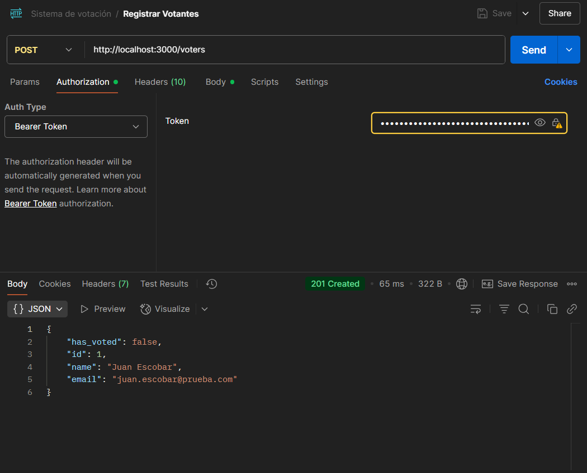
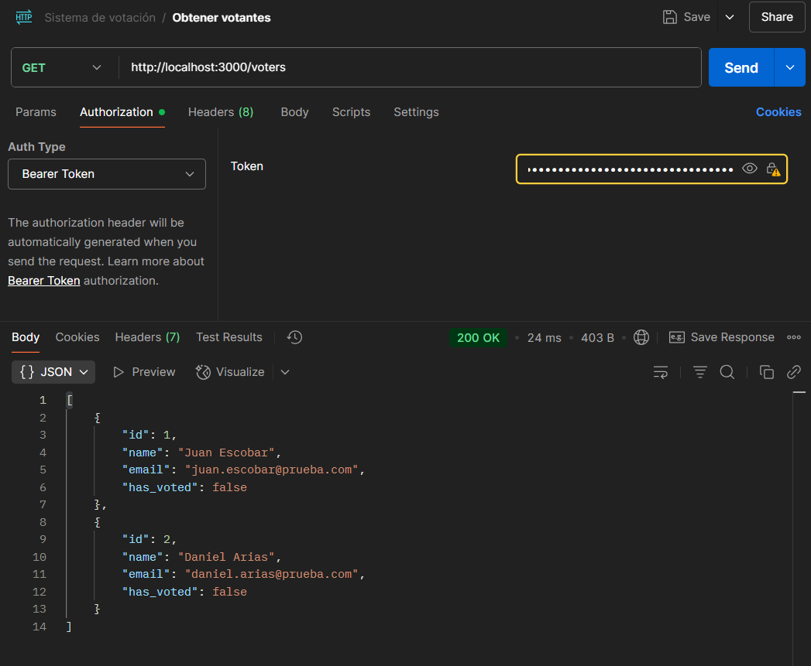
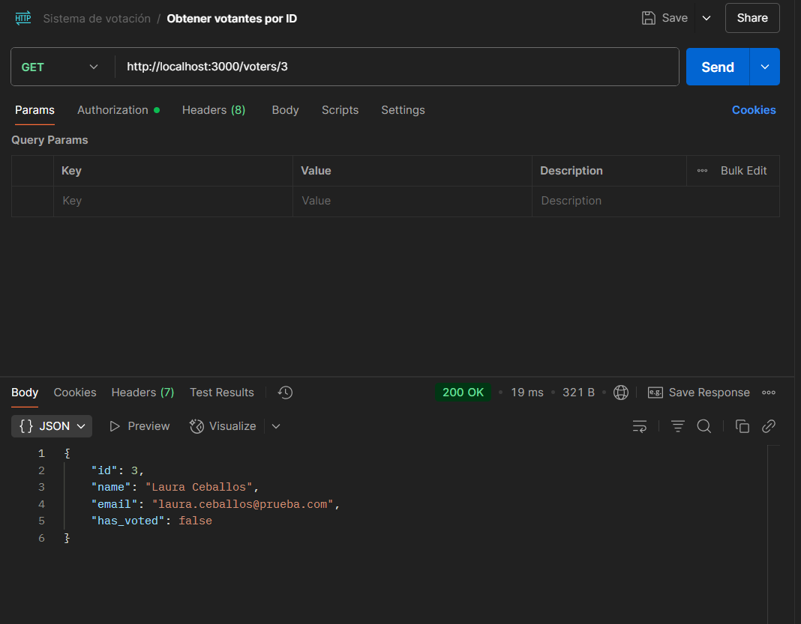
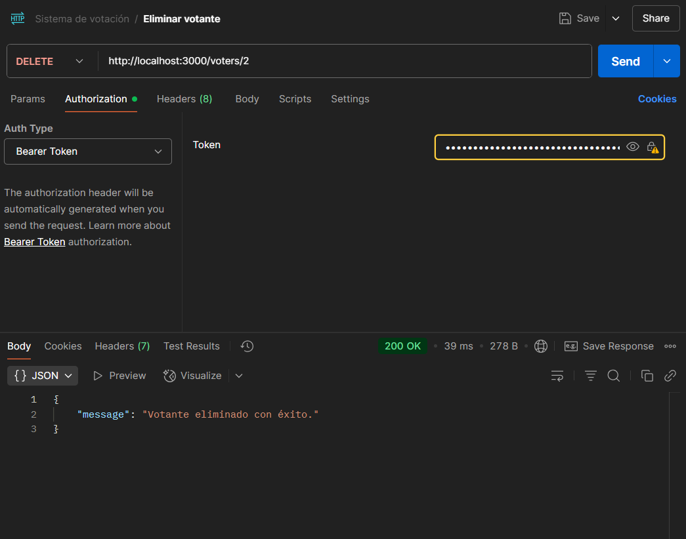
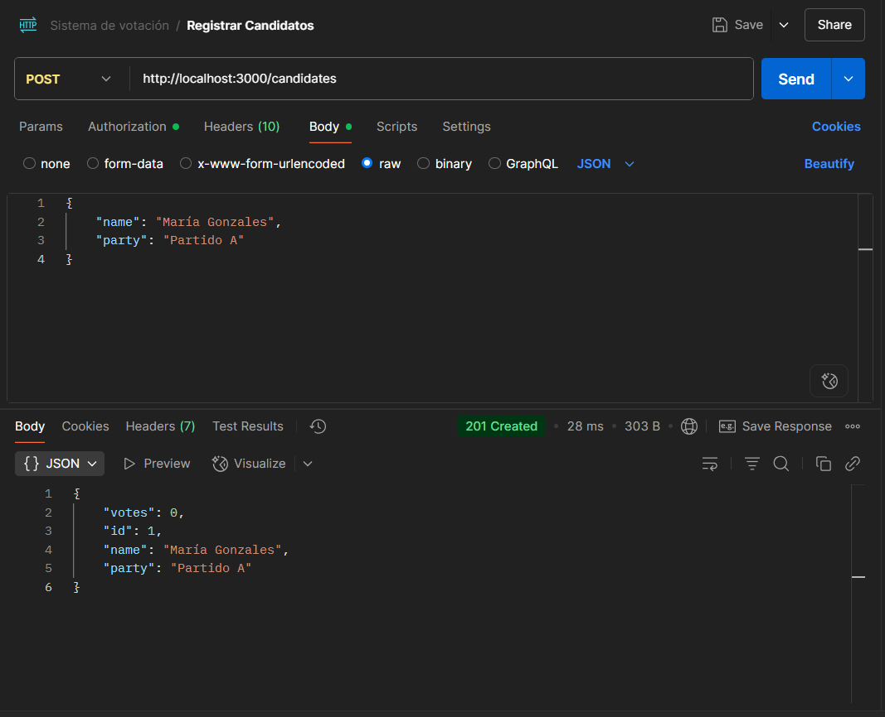
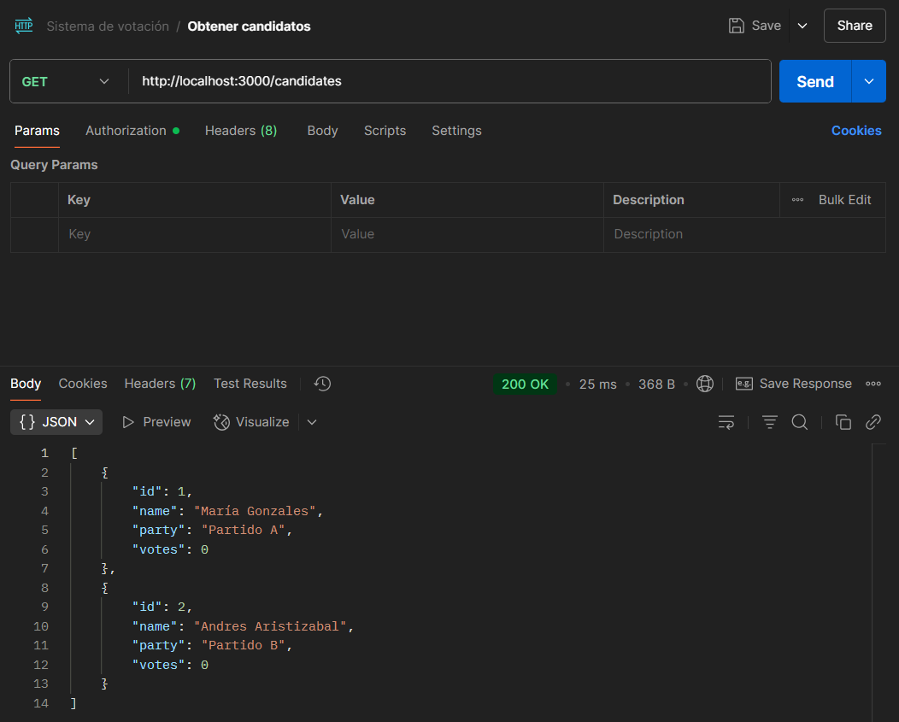
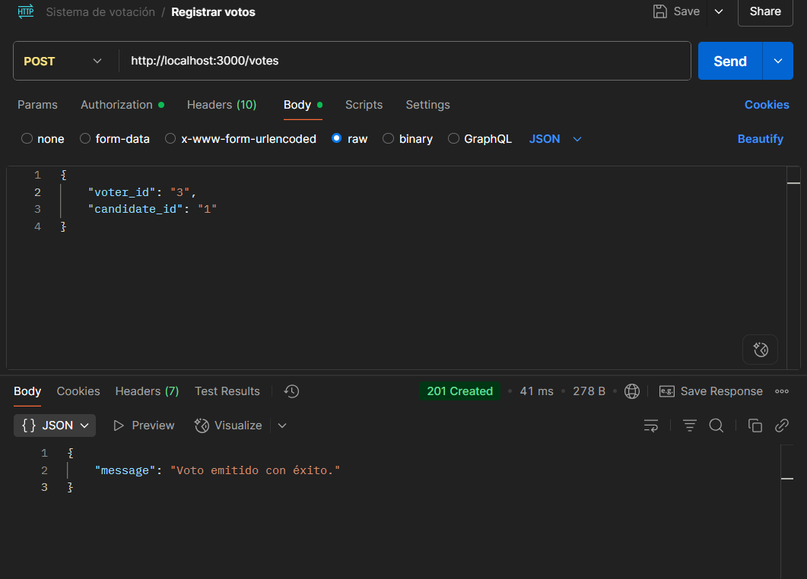
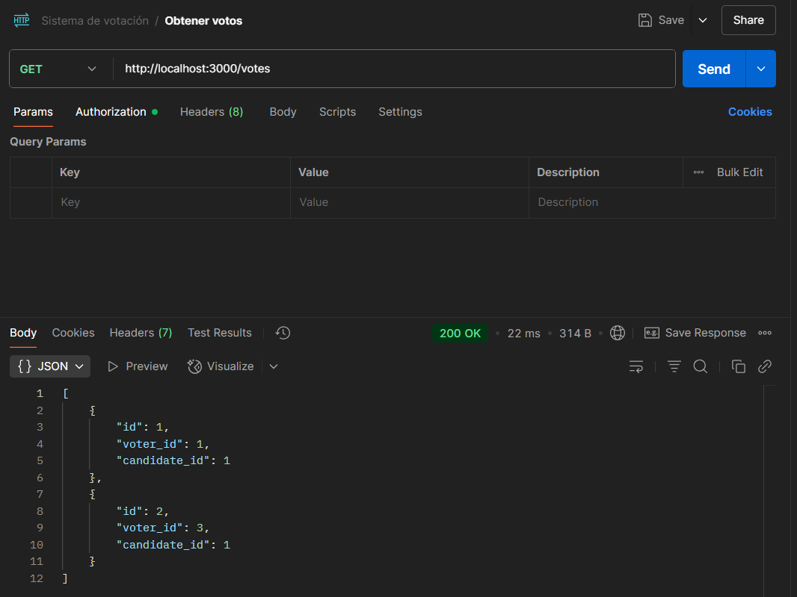
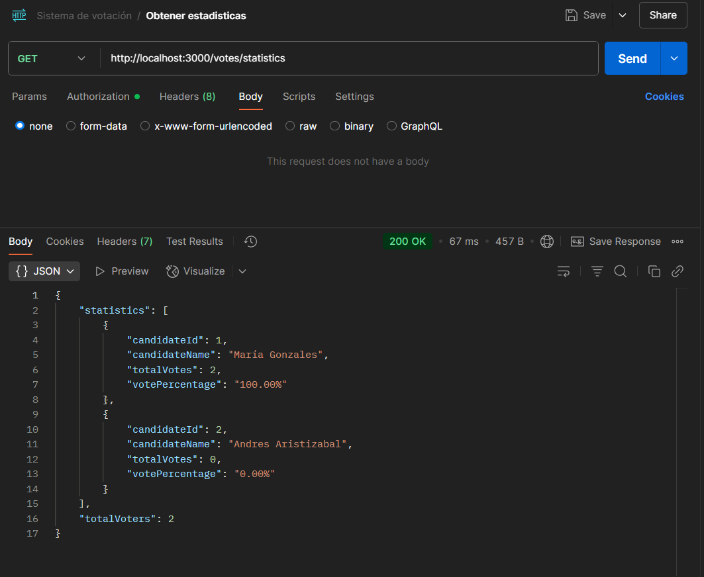

# Sistema de Votaciones

## Descripción
Este proyecto es un sistema de votaciones que permite gestionar votantes, candidatos y emitir votos. La API está protegida con autenticación JWT.

## Endpoints

### Votantes
- `POST /voters`: Registrar un nuevo votante.
- `GET /voters`: Obtener la lista de votantes.
- `GET /voters/{id}`: Obtener detalles de un votante por ID.
- `DELETE /voters/{id}`: Eliminar un votante.

### Candidatos
- `POST /candidates`: Registrar un nuevo candidato.
- `GET /candidates`: Obtener la lista de candidatos.
- `GET /candidates/{id}`: Obtener detalles de un candidato por ID.
- `DELETE /candidates/{id}`: Eliminar un candidato.

### Votos
- `POST /votes`: Emitir un voto.
- `GET /votes`: Obtener todos los votos emitidos.
- `GET /votes/statistics`: Obtener estadísticas de la votación.

## Autenticación
La API utiliza JWT para proteger los endpoints. Se debe incluir un token válido en el encabezado `Authorization` de las solicitudes.

Para generar un token JWT que se puede usar para autenticar las solicitudes a la API, puedes usar el siguiente comando en Node.js:

```bash
node -e "const jwt = require('jsonwebtoken'); const token = jwt.sign({ user: 'admin' }, 'secret_key', { expiresIn: '1h' }); console.log(token);"
```

## Instrucciones para Ejecutar el Proyecto Localmente

1. **Clona el repositorio**:
   ```bash
   git clone https://github.com/JonathanChacon1/voting-system-rest-api.git
   ```

2. **Navega al directorio del proyecto**:

3. **Instala las dependencias**:
   ```bash
   npm install
   ```

4. **Configura las variables de entorno**:
   - Crea un archivo `.env` en la raíz del proyecto con el siguiente contenido:
     ```
     DB_USER=tu_usuario
     DB_PASSWORD=tu_contraseña
     DB_NAME=voting_system
     ```

5. **Crea la base de datos**:
   - Abre MySQL desde la línea de comandos o usa MySQL Workbench.
   - Ejecuta el siguiente comando:
     ```sql
     CREATE DATABASE voting_system;
     ```

6. **Inicia el servidor**:
   ```bash
   node app.js
   ```

7. **Prueba los endpoints** usando una herramienta como Postman puedes asegurarte de que todo funcione correctamente.

## Ejemplos de Uso del API usando Postman

A continuación se presentan algunos ejemplos de cómo interactuar con la API utilizando Postman. Las imágenes muestran las configuraciones de las solicitudes y las respuestas esperadas.

### Crear un Votante
- **Descripción:** Registra un nuevo votante en el sistema.


### Obtener la Lista de Votantes
- **Descripción:** Recupera todos los votantes registrados.


### Obtener Detalles de un Votante por ID
- **Descripción:** Recupera la información de un votante específico usando su ID.


### Eliminar un Votante
- **Descripción:** Elimina un votante del sistema usando su ID.


### Crear un Candidato
- **Descripción:** Registra un nuevo candidato en el sistema.


### Obtener la Lista de Candidatos
- **Descripción:** Recupera todos los candidatos registrados.


### Emitir un Voto
- **Descripción:** Registra un voto en el sistema.


### Obtener Todos los Votos Emitidos
- **Descripción:** Recupera todos los votos registrados en el sistema.


### Obtener Estadísticas de la Votación
- **Descripción:** Muestra estadísticas detalladas de la votación.


Estos ejemplos proporcionan una guía visual sobre cómo interactuar con la API y verificar las respuestas esperadas. 

## Tecnologías usadas
- Node.js
- Express
- MySQL
- Sequelize
- JSON Web Tokens (JWT)

## Autor
Desarrollado por Jonathan Chacon.